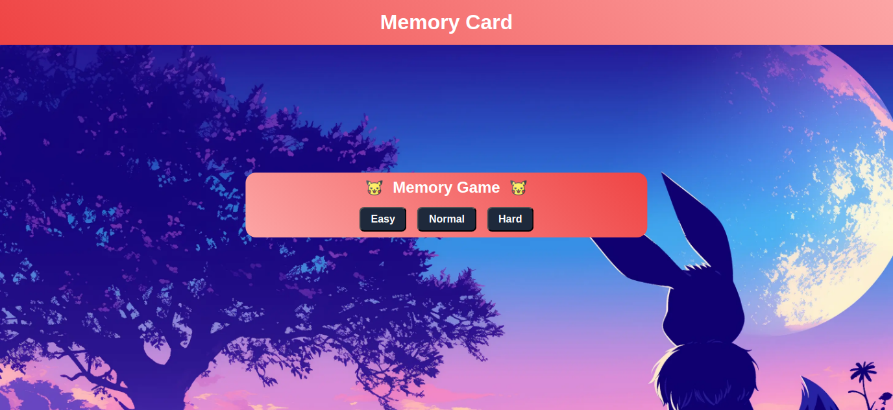
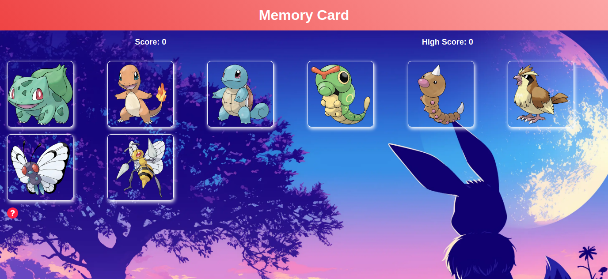
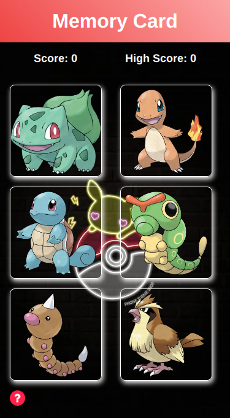

# The Odin Project - Memory Card

This is a solution to the [Memory Card challenge on The Odin Project](https://www.theodinproject.com/lessons/node-path-react-new-memory-card).
## Table of contents

- [Overview](#overview)
  - [Screenshot](#screenshot)
- [My process](#my-process)
  - [Built with](#built-with)
  - [What I learned](#what-i-learned)
- [Author](#author)

## Overview

### Screenshot

  ## Starting screen 
  

  ## Desktop 

  

  ## Mobile 
  

### Links

- Solution URL: [solution](https://github.com/Medido1/The-OdinProject-Memory-Card)
- Live Site URL: [live site](https://medidomemorycard.netlify.app/)

## My process

### Built with

- Semantic HTML5 markup
- CSS custom properties
- CSS Grid
- Flexbox
- Mobile-first workflow
- React

## Author

- Frontend Mentor - [@Medido1](https://www.frontendmentor.io/profile/Medido1)
- GitHub - [@Medido1](https://github.com/Medido1)